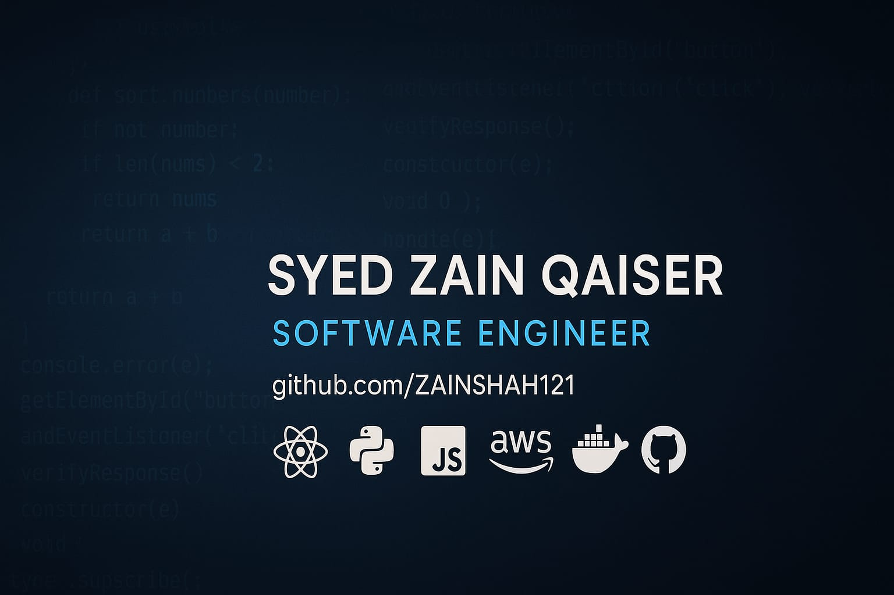

<h1 align="center">Hi there, I’m Syed Zain Qaiser 👋</h1>

  

  

  
  

---

💻 **Full-Stack Software Engineer** | Python | Java | .NET | WebSockets | Cloud Solutions | JavaScript | React | Next.js | Node.js | MERN Stack  

I’m a highly motivated and versatile Full-Stack Software Engineer with extensive experience in crafting scalable, secure, and high-performance web applications for both startups and enterprise-grade businesses. My passion lies in building modern, reliable, and efficient software systems that address real-world challenges.

I hold a Bachelor’s degree in Software Engineering from The Superior University, Lahore, and have successfully delivered multiple real-world projects — including AI-powered CRM systems, ERP solutions, and dynamic E-commerce platforms. My focus lies in crafting seamless user experiences, designing scalable architectures, and developing secure and efficient APIs that align with modern development standards.

I specialize in end-to-end software development — from intuitive frontend interfaces to robust backend logic, cloud deployment, real-time data visualization (WebSockets), and third-party integrations. Whether working on customer-facing products or enterprise-grade platforms, I apply a clean, scalable, and performance-first approach to every solution.

Currently, I am advancing my knowledge and leadership capabilities through a Master’s degree in Information Technology with Project Management at the University of the West of Scotland (UWS).

Outside of coding, I’m deeply passionate about keeping up with the latest tech innovations, improving software design patterns, and collaborating on transformative digital products.

---

### 💡 Core Competencies:
- ⚡ Full Stack Development — React.js | ASP.NET MVC | .NET Core
- ⚡ Real-Time Data Handling — WebSockets, APIs, and Event-Driven Systems
- ⚡ Cloud Deployments — Azure, AWS, IIS Server & CI/CD pipelines
- ⚡ Databases — MSSQL, MongoDB, Firebase
- ⚡ Agile Collaboration — Unit Testing | Code Reviews | GitOps  

---

### 🧠 Key Skills at a Glance:
JavaScript | TypeScript | React.js | Next.js | Svelte  
Redux Toolkit | Tanstack Query | REST APIs | Node.js  
Tailwind | SCSS | Material UI | Strapi | WordPress  
MongoDB | SQL | Git | Jira | SEO | SQA  

---

### 🏆 GitHub Stats:

  

  

  

---

### 🌱 Currently Learning:
- Microservices Architecture
- Advanced Cloud Deployments
- System Design Patterns  

---

### 📫 Let’s Connect!
- 💼 [LinkedIn](https://www.linkedin.com/in/syed-zain-qaiser51214/)
- 🌐 Portfolio Website: _Coming Soon_

---

### ⚡ Fun Fact:
When I’m not writing code, you’ll probably find me exploring new tech, leveling up my knowledge, or outdoors enjoying sports.

---

⭐️ Thanks for stopping by!
