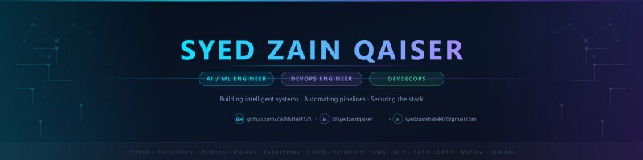

<div align="center">
  
</div>

<br/>

<div align="center">
  <h1>
    
  </h1>
</div>

<div align="center">
  
  &nbsp;
  
</div>

<br/>

<div align="center">

[](https://www.linkedin.com/in/syedzainqaiser)
[](https://github.com/ZAINSHAH121)
[](mailto:syedzainshah442@gmail.com)

</div>

---

## 🧬 About Me

```python
class AIEngineer:
    def __init__(self):
        self.name        = "Syed Zain Qaiser"
        self.role        = ["AI/ML Engineer", "DevOps Engineer", "DevSecOps"]
        self.location    = "United Kingdom 🇬🇧"
        self.experience  = "1+ years professional"
        self.education   = "BSc Computer Software Engineering — The Superior University"
        self.focus       = ["LLMs", "RAG Pipelines", "Generative AI", "MLOps", "Workflow Automation"]
        self.tagline     = "Building intelligent systems · Automating pipelines · Securing the stack"

    def current_work(self):
        return {
            "products"  : ["Feeda Labs", "Feeda AI", "Cheery"],
            "stack"     : ["Python", "FastAPI", "TensorFlow", "Docker", "n8n"],
            "exploring" : ["Agentic AI", "LLM Fine-tuning", "Multi-Agent Systems"]
        }
```

---

## 🧠 Core Expertise

<table>
<tr>
<td valign="top" width="50%">

### 🤖 AI / ML
- Large Language Models (LLMs) — design, fine-tuning, deployment
- Retrieval-Augmented Generation (RAG) pipelines
- Prompt Engineering & Agent Frameworks
- NLP — classification, summarisation, entity extraction
- Computer Vision — object detection, deep learning
- Model evaluation, feature engineering & MLOps

</td>
<td valign="top" width="50%">

### ⚙️ DevOps & Automation
- CI/CD pipelines — GitHub Actions, GitLab CI/CD
- GitOps — declarative, version-controlled infrastructure
- Containerisation — Docker; orchestration basics (Kubernetes)
- Workflow Automation — n8n, webhooks, event-driven pipelines
- Infrastructure as Code (IaC)
- DevSecOps — secrets management, dependency scanning

</td>
</tr>
</table>

---

## 🛠️ Tech Stack

### Languages & Frameworks
<p>


</p>

### AI / ML & Generative AI
<p>


</p>

### DevOps, MLOps & Automation
<p>


</p>

### Cloud & Infrastructure
<p>


</p>

---

## 📊 GitHub Stats


<div align="center">
  
</div>
<br/>

<div align="center">
  
  &nbsp;&nbsp;
  
</div>

<br/>

<div align="center">
  
</div>

<br/>

<div align="center">
  
  &nbsp;
  
</div>

---

## 🚀 Notable Projects

| Project | Description | Stack |
|---|---|---|
| 🧠 **Feeda AI** | AI-powered NLP + computer vision product | Python, TensorFlow, FastAPI |
| 💬 **Cheery** | LLM-based conversational AI application | LLMs, Prompt Engineering, FastAPI |
| 🔁 **n8n Automation Pipelines** | Production-grade workflow automation connecting AI models, REST APIs & SaaS tools | n8n, Webhooks, Python |
| 🌐 **Feeda Labs** | End-to-end generative AI research product | Generative AI, NLP, CV |

---

## 🌱 Currently Exploring

```text
🔬 Advanced RAG Architectures        ████████████░░░░   75%
🤖 Agentic AI & Multi-Agent Systems  ██████████░░░░░░   65%
🧪 LLM Fine-tuning (LoRA / RLHF)    ████████░░░░░░░░   55%
☸️  Kubernetes for ML Serving         ██████░░░░░░░░░░   40%
🔐 DevSecOps Hardening               █████████░░░░░░░   60%
```

---

## 🏅 Certifications

- 🏦 **Lloyds Banking Group** — Data Science Job Simulation
- 💻 **Datacom** — Software Development Job Simulation
- 📊 **Data Science & Analytics** — Product Management Job Simulation
- ✈️ **Skyscanner** — Front-End Software Engineering Job Simulation

---

## 📫 Let's Connect

<div align="center">

| Platform | Link |
|---|---|
| 💼 LinkedIn | [linkedin.com/in/syedzainqaiser](https://www.linkedin.com/in/syedzainqaiser) |
| 🐙 GitHub | [github.com/ZAINSHAH121](https://github.com/ZAINSHAH121) |
| 📧 Email | [syedzainshah442@gmail.com](mailto:syedzainshah442@gmail.com) |

</div>

---

<div align="center">

### ⚡ Fun Fact

*When I'm not building AI systems or automating pipelines, you'll find me exploring the latest in ML research, tinkering with new tools, or enjoying sports outdoors.*

---


</div>
