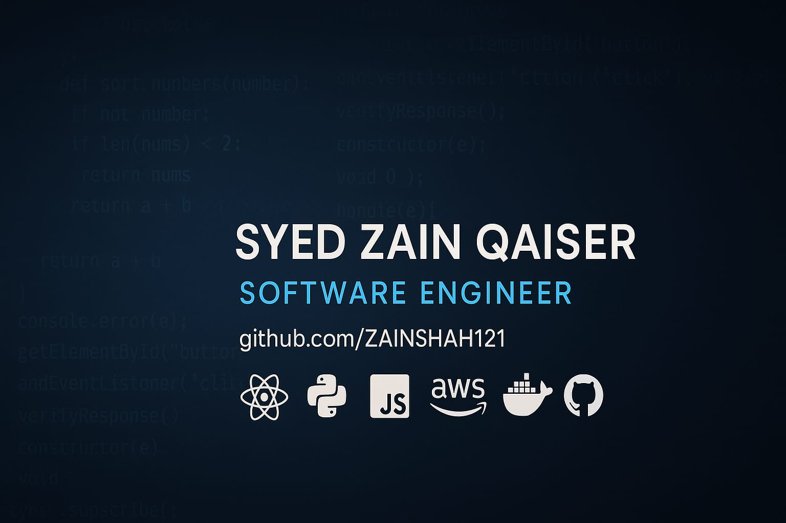

<h1 align="center">Hi there, I’m Syed Zain Qaiser </h1>

  

  

  
  

---

💻 **Full-Stack AI Software Engineer** | Python | FastAPI | Machine Learning | LLMs | Cloud Solutions | Prompt Engineering AI Models | NLP & Automation | Building Scalable AI Systems

I’m a highly motivated and results-driven AI Software Engineer with a strong foundation in Artificial Intelligence, Machine Learning, Deep Learning, Large Language Models (LLMs), and Natural Language Processing (NLP). I specialize in designing and deploying intelligent, data-driven systems that combine advanced AI models with robust, scalable software architectures.

With hands-on experience in developing AI-powered applications, predictive analytics systems, chatbots, and automation tools, I excel at transforming complex business challenges into efficient, real-world solutions. My expertise spans the full development lifecycle — from model training and fine-tuning to backend integration, API design, and full-stack deployment on modern cloud environments.

I have successfully delivered AI-driven CRM systems, recommendation engines, ERP solutions, and intelligent E-commerce platforms, ensuring seamless performance, scalability, and security. My technical approach emphasizes clean architecture, performance optimization, and continuous innovation, allowing me to bridge the gap between machine learning research and production-grade engineering.

Beyond building systems, I’m deeply passionate about exploring cutting-edge AI technologies, optimizing neural network performance, and advancing the use of LLMs for automation, NLP, and human-AI collaboration. I thrive in fast-paced, research-driven environments that value innovation, experimentation, and meaningful problem-solving.

---

💡 Core Competencies:

🤖 Artificial Intelligence & Machine Learning — ML/DL model development, model fine-tuning, and data preprocessing

🧠 Large Language Models (LLMs) & NLP — prompt engineering, text classification, embeddings, chatbots, and generative AI integration

⚙️ Full Stack & Backend Development — Python (FastAPI, Flask, Django), React.js, Node.js, Express

☁️ Cloud & MLOps — AWS, Azure, Docker, CI/CD, model deployment & API orchestration

🗄️ Data Engineering & Databases — SQL, MongoDB, Firebase, and vector databases (Pinecone, Chroma)

🔍 System Design & Optimization — scalable architectures, API security, performance tuning, and automation pipelines

🤝 Agile Collaboration — Git, version control, unit testing, and cross-functional teamwork  

---

### 🧠 Key Skills at a Glance:
Python | FastAPI | Flask | Django | JavaScript | TypeScript
React.js | Next.js | Node.js | Express.js | Tailwind CSS
Machine Learning (ML) | Deep Learning (DL) | Natural Language Processing (NLP)
Large Language Models (LLMs) | Prompt Engineering | Generative AI
PyTorch | TensorFlow | Scikit-learn | LangChain | Hugging Face
MongoDB | SQL | Firebase | Vector Databases (Pinecone, Chroma)
AWS | Azure | Docker | Kubernetes | CI/CD | Git | Agile 

---

### 🏆 GitHub Stats:

  

  

  

---

### 🌱 Currently Learning:
- Microservices Architecture
- Advanced Cloud Deployments
- System Design Patterns  

---

### 📫 Let’s Connect!
- 💼 [LinkedIn](https://www.linkedin.com/in/syedzainqaiser)
- 🌐 [Portfolio](https://zainfolio.web.app)

---

### ⚡ Fun Fact:
When I’m not writing code, you’ll probably find me exploring new tech, leveling up my knowledge, or outdoors enjoying sports.

---

⭐️ Thanks for stopping by!
